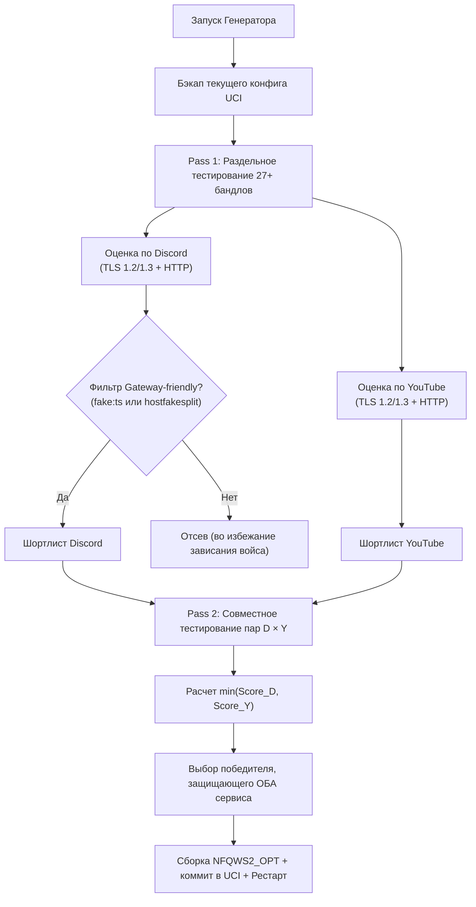

# 🛡️ Zapret2-Manager

**Модульный консольный менеджер и автоскрипт подбора/генерации стратегий для [zapret2-openwrt](https://github.com/1andrevich/zapret2-openwrt) на базе алгоритмов [Asterlike/zapret2UI](https://github.com/Asterlike/zapret2UI).**

[](https://openwrt.org)
[](https://github.com/1andrevich/zapret2-openwrt)
[](LICENSE)

---

## 📖 О проекте

**Zapret2-Manager** — это автономная утилита для роутеров OpenWrt с установленным пакетом **zapret2** (nfqws2). Она решает главную проблему обхода DPI: **необходимость ручного перебора сотен параметров под каждого конкретного провайдера**.

Мы **не модифицируем сам zapret2** и не собираем форки — менеджер работает как интеллектуальная надстройка (аналогично [Zapret-Manager от StressOzz](https://github.com/StressOzz/Zapret-Manager)), управляя официальным пакетом от `1andrevich` через стандартные интерфейсы OpenWrt (`uci`, `sync_config.sh`, `init.d`).

### 🧬 Ключевые возможности:
- 🧬 **Двухпроходный генератор стратегий (Two-Pass Generator)**: перенесен прямо из [Asterlike/zapret2UI](https://github.com/Asterlike/zapret2UI). Тестирует сетку из 27+ десинк-бандлов, отдельно ранжирует их для Discord и YouTube, отбирает шортлист с защитой **Gateway-friendly** и подбирает идеальное сочетание.
- ⚡ **Автоподбор из проверенного каталога (Auto-Selector)**: перебор 9 готовых комбо-стратегий (Рекомендуемый, Flowseal ALT10/11, Отечественный VK, Окно wssize, Circular адаптивный) с выбором победителя под вашего провайдера.
- 🩺 **Реалистичный сетевой пробник (NetProbe)**: трехточечный замер каждого хоста — **TLS 1.2**, **TLS 1.3** и **HTTP/2 GET** с верификацией полезной нагрузки (`ytcfg`, `discord`) и отсевом страниц-заглушек ТСПУ/РКН.
- 📁 **Управление хостлистами и исключениями**: готовые актуальные списки для YouTube, Discord и исключений чувствительных сервисов (Госуслуги, банки, российские CDN).
- 📦 **Поставка фейковых блобов**: включает бинарные блобы ClientHello и QUIC (`tls_vk`, `tls_sber`, `quic_vk` и др.) для работы продвинутых стратегий.

---

## 🚀 Быстрая установка на роутер

Подключитесь к роутеру по SSH и выполните одну команду:

```sh
sh <(curl -fsSL https://raw.githubusercontent.com/Floorys/Z2-Manager/main/install.sh)
```

Или через `wget`:
```sh
sh <(wget -qO- https://raw.githubusercontent.com/Floorys/Z2-Manager/main/install.sh)
```

Инсталлятор автоматически настроит права, создаст симлинк `/usr/bin/z2m` и установит необходимые списки и фейковые блобы.

После установки панель запускается простой командой:
```sh
z2m
```

---

## 🖥️ Использование

### 1. Интерактивное TUI-меню

Запустите команду `z2m` без аргументов для входа в главное меню:

```
  ███████╗ █████╗ ██████╗ ██████╗ ███████╗████████╗██████╗     ███╗   ███╗
  ╚══███╔╝██╔══██╗██╔══██╗██╔══██╗██╔════╝╚══██╔══╝╚════██╗    ████╗ ████║
    ███╔╝ ███████║██████╔╝██████╔╝█████╗     ██║    █████╔╝    ██╔████╔██║
   ███╔╝  ██╔══██║██╔═══╝ ██╔══██╗██╔══╝     ██║   ██╔═══╝     ██║╚██╔╝██║
  ███████╗██║  ██║██║     ██║  ██║███████╗   ██║   ███████╗    ██║ ╚═╝ ██║
  ╚══════╝╚═╝  ╚═╝╚═╝     ╚═╝  ╚═╝╚══════╝   ╚═╝   ╚══════╝    ╚═╝     ╚═╝
  Zapret2 Manager v1.0.0 | Asterlike & 1andrevich Architecture
  ───────────────────────────────────────────────────────────────────

  Статус Zapret2: Активна (nfqws2 PID: 4521)
  ───────────────────────────────────────────────────────────────────

  1. ⚡ Автоподбор стратегии          (тест каталога и выбор лучшей)
  2. 🧬 Генератор персональной стратегии  (Pass 1 + Pass 2 по Asterlike)
  3. 🎯 Выбор стратегии из каталога       (Рекомендуемый, Flowseal, VK...)
  4. 🩺 Диагностика сети и блокировок     (TLS, HTTP reach, сигнатуры ТСПУ)
  5. 📁 Управление списками доменов       (YouTube, Discord, Исключения)
  6. 🔄 Перезапустить службу Zapret2
  7. 📦 Синхронизировать фейковые блобы и хостлисты
  0. Выход
```

### 2. Запуск через аргументы командной строки (для автоматизации)

- `z2m -a` или `z2m --autoselect` — запуск автоподбора без диалогов.
- `z2m -g` или `z2m --generate` — запуск генератора персональной стратегии.
- `z2m -d` или `z2m --diagnostics` — вывод отчета диагностики доступности.
- `z2m -r` или `z2m --restart` — перезапуск службы zapret2 с перечитыванием UCI.
- `z2m -s` или `z2m --status` — проверка статуса демона.

---

## 🧠 Как работает генератор (Алгоритм Asterlike)

В отличие от простого перебора, генератор разделяет задачу на **два прохода**:



1. **Pass 1**: каждый бандл проверяется изолированно. Замеряются рукопожатия TLS 1.2/1.3 и загрузка страниц с браузерным User-Agent и проверкой внутренних маркеров страницы.
2. **Фильтр Gateway-friendly**: Discord использует особый размер ClientHello для соединения с голосовыми шлюзами (`gateway.discord.gg`). Непраймированные стратегии с большими смещениями `seqovl` пускают на сайт логина, но намертво вешают голосовой шлюз. Генератор допускает в шортлист только адаптивные бандлы (`hostfakesplit` или праймированные `fake:tcp_ts`).
3. **Pass 2**: пары топ-кандидатов собираются в единое правило через `combo_builder.sh` и тестируются вместе. Выбирается связка, максимизирующая результат слабейшего из сервисов.

---

## 🎯 Каталог готовых стратегий

| Стратегия | Описание | Когда применять |
|---|---|---|
| **1. Комбо (рекомендуемый)** | Discord → `hostfakesplit`, YouTube → `fake:md5+seq multidisorder`, голос → `quic_vk` | Универсальный вариант — начинайте с него |
| **2. Комбо — отечественный (VK)** | Discord → `hostfakesplit vk.com`, YouTube → `fake multidisorder` | Если провайдер режет гугл-фейки |
| **3. Комбо — Flowseal ALT10** | Двойной fake (google + vk) с `tcp_ts=-1000` без сплита | Когда не работают медиа и голосовой шлюз |
| **4. Комбо — Flowseal ALT11** | Fake ts + `multisplit seqovl=681` (google pattern) | Высокая пробиваемость жестких ТСПУ |
| **5. Комбо — Flowseal Multisplit** | Чистый multisplit с перекрытием `seqovl=681` | Альтернатива сплита без фейков |
| **6. Комбо — Flowseal ALT** | Fake с `tcp_ts` + ложная разрезка `fakedsplit` | Если чистый multisplit не работает |
| **7. Комбо — окно (wssize)** | Multisplit + дробление окна ответа сервера (`wsize=1:scale=6`) | Для упрямых блокировок |
| **8. Discord — адаптивный (circular)** | Ротация стратегий на лету при детекте RST (`fails=2`) | Экспериментальный самоподстраивающийся профиль |
| **9. Discord — голос (QUIC-фейк)** | Точечная починка STUN + RTP без затрагивания веб-профилей | Если подключается, но вечный пинг 5000 |

---

## 📂 Структура проекта

```
Zapret2Manager/
├── zapret2-manager.sh      # Главный CLI/TUI интерфейс
├── install.sh              # Скрипт онлайн-установки
├── README.md               # Документация проекта
├── LICENSE                 # Лицензия MIT
├── core/
│   ├── config.sh           # Системные пути, цвета, константы
│   ├── zapret_service.sh   # UCI get/set, синхронизация и рестарт демона
│   ├── probe.sh            # Сетевой пробник (TLS 1.2/1.3, HTTP/2, сигнатуры ТСПУ)
│   ├── combo_builder.sh    # Построитель аргументов NFQWS2_OPT
│   └── tui.sh              # TUI оформление, таблицы, прогресс
├── modules/
│   ├── generator.sh        # Двухпроходный генератор (Asterlike)
│   ├── autoselect.sh       # Автоподбор из каталога
│   ├── diagnostics.sh      # Комплексная диагностика сети и блокировок
│   └── hostlists.sh        # Менеджер списков доменов и исключений
├── strategies/
│   ├── catalog.sh          # База встроенных комбо-стратегий
│   └── candidates.sh       # Сетка 27+ десинк-бандлов для генератора
├── lists/
│   ├── zapret-hosts-youtube.txt     # Актуальный список доменов YouTube
│   ├── zapret-hosts-discord.txt     # Актуальный список доменов Discord
│   └── zapret-hosts-user-exclude.txt# Исключения (госуслуги, банки, RU-сервисы)
└── fake/
    ├── tls_clienthello_www_google_com.bin
    ├── tls_clienthello_vk_com.bin
    ├── tls_clienthello_sberbank_ru.bin
    ├── tls_clienthello_gosuslugi_ru.bin
    ├── quic_initial_www_google_com.bin
    └── quic_initial_vk_com.bin
```

---

## 🛠️ Совместимость и требования

- **Роутер**: OpenWrt 23.05, 24.10, 25.12+ (firewall4 / nftables).
- **Пакеты**: установленный [zapret2-openwrt](https://github.com/1andrevich/zapret2-openwrt) (`zapret2` + `luci-app-zapret2`), утилита `curl`.
- **ПК / Клиенты сети**: для корректной работы стратегий с временными метками (`tcp_ts`) на устройствах Windows рекомендуется включить TCP timestamps:
  ```cmd
  netsh int tcp set global timestamps=enabled
  ```

---

## 📄 Лицензия

Проект распространяется под лицензией MIT. Подробнее см. в файле [LICENSE](LICENSE).
Благодарности авторам:
- **Asterlike** за концепцию и реализацию генератора в [zapret2UI](https://github.com/Asterlike/zapret2UI).
- **1andrevich** за пакет [zapret2-openwrt](https://github.com/1andrevich/zapret2-openwrt).
- **bol-van** за оригинальный [zapret](https://github.com/bol-van/zapret).
- **Flowseal** за сообщество и актуальные наработки по обходу DPI.
- **StressOzz** за концепцию модульного автоскрипта для OpenWrt [Zapret-Manager](https://github.com/StressOzz/Zapret-Manager).
